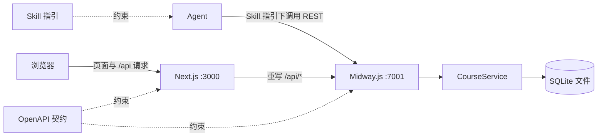

# 系统架构

## 设计边界

- `frontend` 负责页面渲染、交互状态和用户体验。
- `backend` 负责 HTTP 边界、业务规则和数据持久化。
- `contracts` 是前后端共同遵守的接口事实来源。
- `specs` 说明为什么做、为谁做，以及如何判断完成。
- Agent 通过 [Skills](./skills/README.md) 复用同一 REST 契约；Skill 不复制业务逻辑，也不提高权限。

功能开发遵循 `specs → contracts → frontend/backend → test/check`。Spec、Contract、ADR 与测试各自的边界和当前模板成熟度见[模板结构审查](./architecture-review.md)。

## 架构决策记录

- [ADR-001：课程列表响应式布局的职责边界](./adr/001-course-list-responsive-boundary.md)
- [ADR-002：课程搜索的职责与数据访问边界](./adr/002-course-search-responsibility-boundary.md)（提议中，未实施）

ADR 记录需要长期遵守的技术取舍；用户可见行为和验收标准仍以关联 Spec 为准。

## 请求链路

开发环境中，浏览器请求 Next.js 的 `/api/*`。Next.js 按 `BACKEND_INTERNAL_URL` 将请求重写到 Midway。这样本地开发和部署都保持同源请求，后端无需放宽 CORS。

Agent 也可直接请求 Midway（例如 `http://localhost:7001/api/courses`），按 [find-courses Skill](./skills/find-courses.md) 解释结果；当前列表 API 无服务端关键词参数。

## 数据策略

课程项目固定使用 Node.js 24，因此直接使用 `node:sqlite`。数据库默认位于 `backend/data/course-demo.sqlite`，不进入版本控制。当前用建表语句完成初始化；当课程进入 schema 演进章节时，应替换成显式迁移机制。

当前 `CourseService` 为保持首个示例最小而直接访问 SQLite。增加新的业务流程、数据源或正式 schema 演进时，应将数据访问抽到 Repository，并让 Service 只保留业务规则、流程编排和事务边界。
